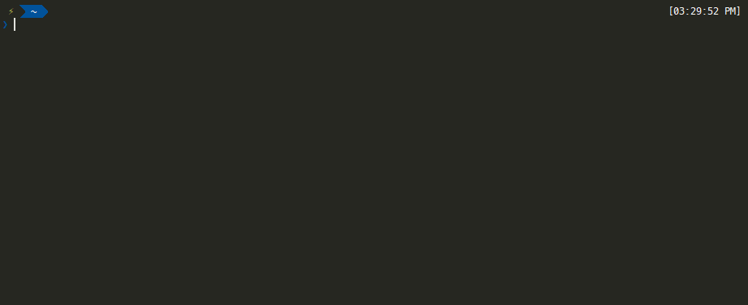
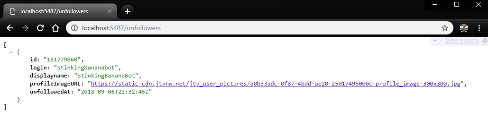

<p align="center"><a href="https://www.twitch.tv/" target="_blank" rel="noopener noreferrer"></a></p>

# TUT, Twitch Unfollow Tracker
A prototype twitch unfollow tracker utlizing the latest twitch API and developed using Go.
<p align="center"><a href="https://www.twitch.tv/" target="_blank" rel="noopener noreferrer"></a></p>

_Please Noted: The GIF may not reflect the latest build. And the followers update interval in the demo GIF is 1 minute for demonstration purpose and I also have fast-forwarded the GIF. The default update interval is 1 hour._

# Installation
## Install via go command:
```
$ go get -u github.com/stinkingbanana/tut
```
## Uninstall via go command:
```
$ go clean -i github.com/stinkingbanana/tut
```

## Download from realease page:  
[https://github.com/StinkingBanana/tut/releases](https://github.com/StinkingBanana/tut/releases)

# To Use

1. Start the program 
2. Enter the clientID of yours or use the default clientID. (Your input will be remembered.)  
Obtain your own clientID from [https://dev.twitch.tv/dashboard](https://dev.twitch.tv/dashboard).  
3. Enter the OAuth token of yours or don't use any. (Your input will be remembered.)  
Obtain your own OAuth token from [https://twitchapps.com/tmi/](https://twitchapps.com/tmi/). Copy and paste the whole ```oauth:[tokens]```.  
3. Enter twitch username to track. (Your input will be remembered.)
4. Enter the server port or use the default port. (Your input will be remembered.)
5. DONE. You just keep the program alive, it will monitor unfollows and refollows.

# Avialiable Endpoints
The program will host a server at ```http://localhost:5487```.
<p align="center"><a href="https://www.twitch.tv/" target="_blank" rel="noopener noreferrer"></a></p>

## Get Followers
```
http://localhost:5487/followers
```

## Get Unfollowers
```
http://localhost:5487/unfollowers
```

## More endpoints?
Please check
```
http://localhost:5487
```

# NOTE
1. Please make sure you sync or keep your computer time updated.
2. This is a quick and dirty prototype, not perfect at all. Let me know if there is any issues.
3. The default database name is ```TUT.db```, it will be created wherever you run the program. 
4. Please be paitent if you have large amount of followers.  
Due to API request limit, it can only process 3000 followers' ID per minute or 30 followers detailed profile info per minute.  
If you have provided valid oauth token, it will process 12000 followers' ID per minute or 120 followers detailed profile info per minute.

# FAQ
## How to Obtain Client ID?
Obtain your own clientID from [https://dev.twitch.tv/dashboard](https://dev.twitch.tv/dashboard)

## How to Obtain OAuth token
Obtain your own OAuth token from [https://twitchapps.com/tmi/](https://twitchapps.com/tmi/)